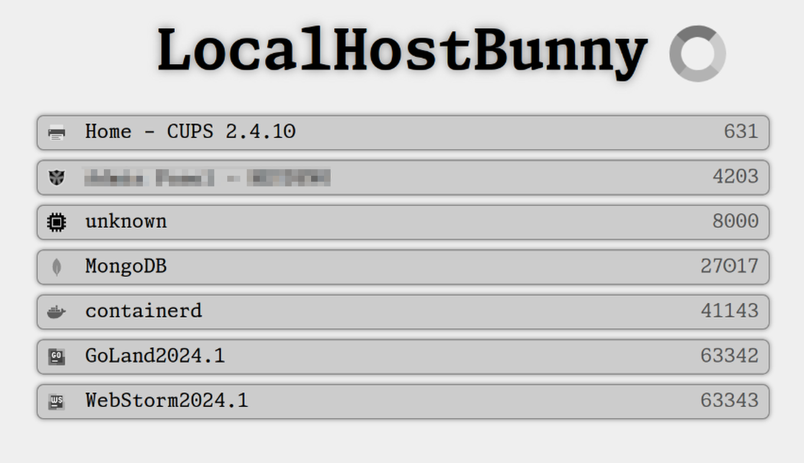

LocalHostBunny
=================

Shows all locally running webserver for quick access




# Systemd Unit


```
#> vim /etc/systemd/system/localhostbunny.service
```

```
[Unit]
Description=LocalhostBunny
After=network.target
Wants=network-online.target

[Service]
Restart=always
Type=simple
User=root
Group=root
WorkingDirectory=/home/{{USER}}
ExecStart=/home/{{USER}}/bunny
Environment=

[Install]
WantedBy=multi-user.target
```

```
#> systemctl daemon-reload
#> systemctl enable --now "localhostbunny"
```
